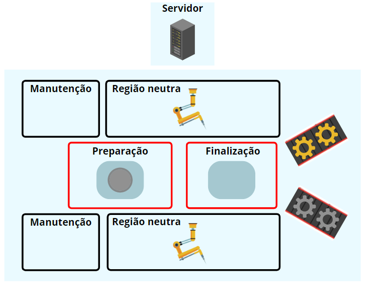
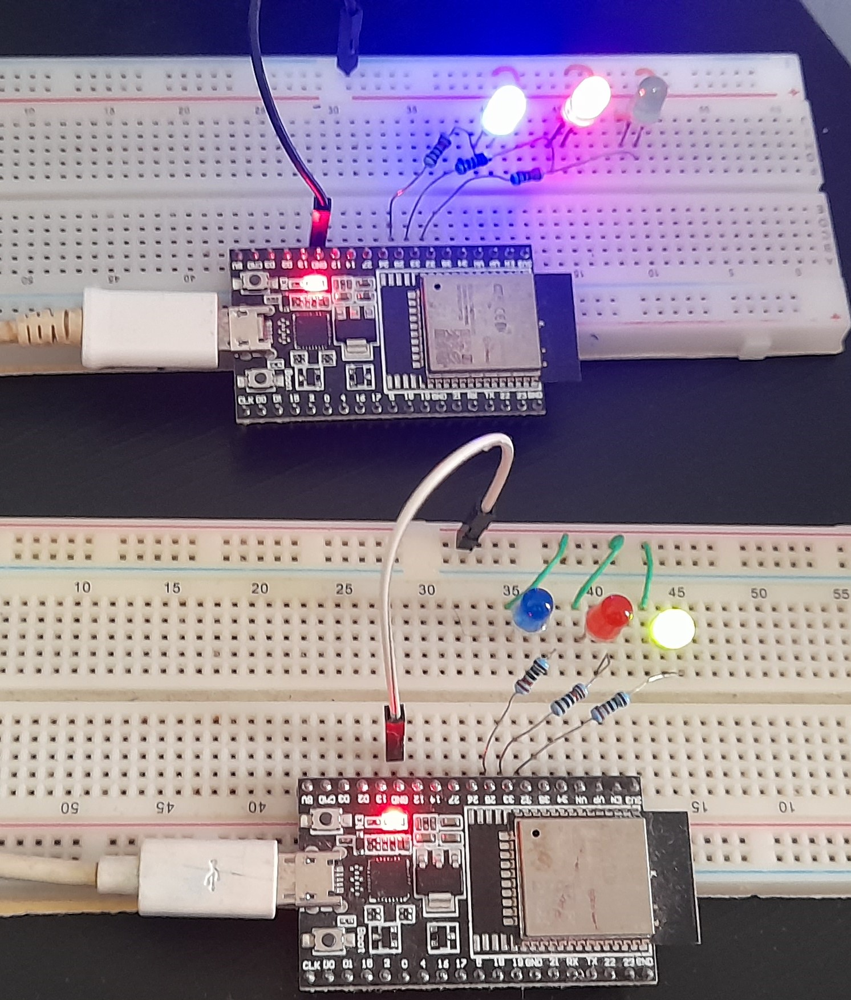

# **Arquitetura para controle supervisório descentralizado**

## **Introdução**

Esta documentação tem o intuito de apresentar as tecnologias e equipamentos utilizados na implementação desta arquitetura. Bem como os passos necessários para qualquer um replicar este projeto localmente e iniciar o desenvolvimento de novas funcionalidades.

A arquitetura é dividida em dois componentes principais. O servidor, que é responsável por toda a lógica de controle, e os módulos locais, que são responsáveis por todas as ações físicas de cada equipamento industrial.

Esta divisão pode ser observada na figura abaixo, que é o caso prático base desta pesquisa:

Fig1. Caso prático base da pesquisa.

Apesar do caso possuir uma série de equipamentos, a pesquisa teve foco na arquitetura, isto quer dizer que esse ambiente foi apenas simulado. E o resultado visual é mostrado a seguir.

Fig2. Simulação do caso prático apresentado.

## **Equipamentos utilizados**

Assim sendo, para replicar esta implementação o usuário deve possuir os seguintes equipamentos:

1. Computador com o sistema operacional Linux (Dica: usuários do Windows podem utilizar o Windows Subsystem for Linux WSL).

2. Microcontrolador ESP32: 2 unidades.

3. LEDs: 6 unidades (azul: 2, vermelho: 2, verde: 2).

4. Jumpers e 2 cabos USB para alimentação dos microcontroladores. 

## **Passos para a implementação**

### **SERVIDOR**

Para replicar o servidor, os seguintes passos devem ser utilizados:

1. Instalar o python3 na máquina

2. Clonar o repositório: **git clone https://github.com/GeovanyADC/IC_TCC.git**

3. Entrar no diretório do projeto: **cd ./IC_TCC/http_server/**

4. Instalar o ambiente virtual: **python3 -m pip install --user virtualenv**

5. Criar um ambiente virtual: **python3 -m venv env**

6. Ativar o ambiente virtual: **source env/bin/activate**

7. Instalar as dependências do arquivo requirements.txt: **pip3 install -r requirements.txt**

8. Iniciar o servidor: **python3 server.py**

Já é possível inserir a rota **http://localhost:8000/docs** no navegador para acessar a api interativa do Fast API e executar os testes.

#### **Acesso local**

Fazer o encaminhamento de porta:
- netsh interface portproxy add v4tov4 listenport=8000 listenaddress=0.0.0.0 connectport=8000 connectaddress=172.20.19.198

A opção connectaddress=(172.30.65.138) é o IP do WSL (pode ser recuperado com o comando: **ifconfing** no terminal do WSL)

Adicionar uma regra de entrada no firewall do windows, pode ser manualmente ou com o código:
- netsh advfirewall firewall add rule name="Allowing LAN connections" dir=in action=allow protocol=TCP localport=8000

É possível acessar a API de outro computador na rede local com o ipv4 do pc -> 192.168... (pode ser obtido com o comando **ipconfig** no terminal do Windows).

#### **Banco de dados**

Para o funcionamento completo desta aplicação, é necessário instalar o banco de dados postgresql, criar usuário, configurar a base de dados e passar os parâmetros na função **insert_into_database**, no arquivo **main.py**. Recomenda-se instalar o postgresql no WSL e acessar via PGAdmin no próprio Windows.

### **MÓDULOS LOCAIS**

As etapas a seguir devem ser efetuadas para a implementação da aplicação no microcontrolador ESP32. Logo, é padrão para ambos os projetos, tanto para o braço robótico A quanto para o braço robótico B.

Os passos foram realizados no sistema operacional Windows, e fazendo uso do Visual Studio Code (VSCode). Assim sendo, recomenda-se:

1. Ter uma cópia deste projeto em um diretório do Windows e entrar no diretório do braço robótico A ou B.

2. Acesse o terminal do Windows neste diretório.

3. Efetuar o comando **code .** no terminal do Windows, irá abrir a IDE.

4. Instalar a extensão do framework de desenvolvimento do ESP32 (ESP-IDF), que é **Espressif IDF**.

5. Instalar o driver para reconhecimento da porta no Windows. Conceitos relacionados podem ser encontrados em [Conceitos](https://docs.espressif.com/projects/esp-idf/en/latest/esp32/get-started/establish-serial-connection.html), e o driver em [Driver](https://www.silabs.com/developers/usb-to-uart-bridge-vcp-drivers).

6. Usar os comandos do ESP-IDF ou os ícones no VSCode que aparecem após a instalação, seja para compilar ou efetuar a gravação no microcontrolador.

